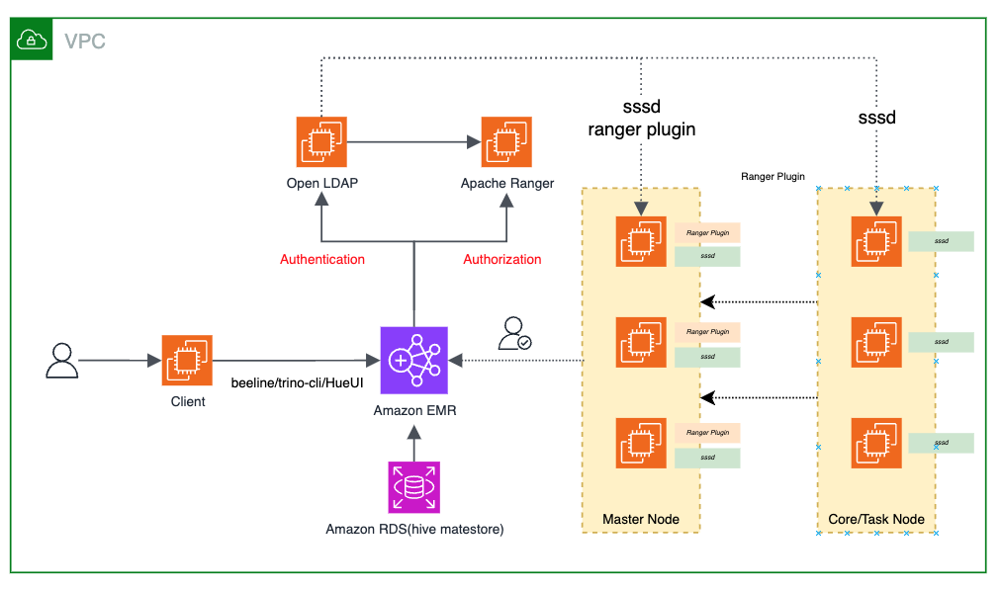

# Aamzon EMR Multi-Master with Open LDAP and Apache Ranger

This Project is for deploy a solution of use *OpenLDAP + Apache Ranger* to fine-grainedly control user access rights.

It will create a RDS for hive metastore, a EMR Cluster, and a EC2 instance for install Open LDAP and Apache Ranger.

It's a CDK script, will help you deploy the solution simple and quickly.

```shell
git clone https://github.com/norrishuang/emr-openldap-ranger-deploy.git
cd emr-openldap-ranger-deploy

cdk bootstrap

# if you have a exists vpc
export VPC_ID=<vpc-xxxxx>
cdk deploy --all
```


**Include Resources:**
* VPC
* RDS
* EMR
* EC2 for install Open LDAP and Apache Ranger


