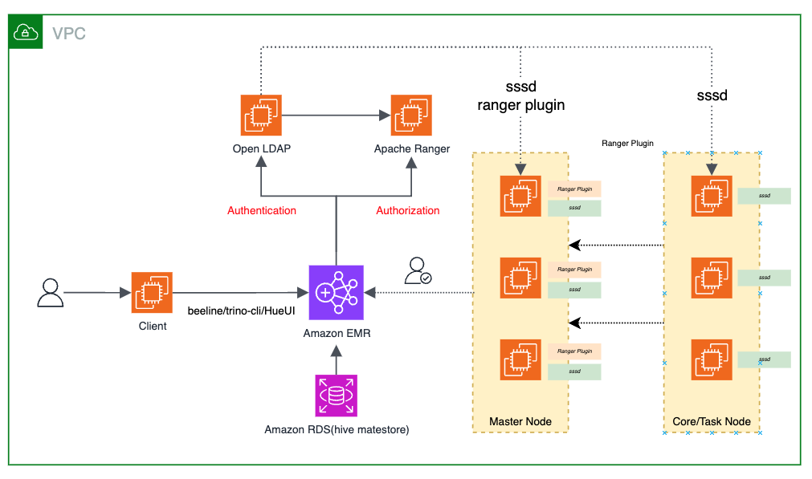

# Amazon EMR Multi-Master with Open LDAP and Apache Ranger

This Project is for deploy a solution of use *OpenLDAP + Apache Ranger* to fine-grainedly control user access rights.

It will create a RDS for hive metastore, a EMR Cluster, and EC2 instances for install Open LDAP and Apache Ranger.

It's a CDK script, will help you deploy the solution simple and quickly.

---

#### Version
Update 2024-11-25
* Add an EC2 instance for install phpLDAPAdmin

---

#### Deployment Types

This project supports two deployment types:

1. **opensource**: Deploy EMR with open-source Ranger plugins (fully automated)
2. **emr-native**: Deploy EMR with native Ranger integration (requires manual EMR creation and configuration)

---

## Deployment Guide

### Option 1: OpenSource Deployment (Fully Automated)

This option deploys everything automatically including EMR cluster.

#### Step 1: Deploy Infrastructure

```shell
git clone https://github.com/norrishuang/emr-openldap-ranger-deploy.git
cd emr-openldap-ranger-deploy

cdk bootstrap

# Deploy with opensource
export DEPLOYMENT_TYPE=opensource

# Optional: if you have an existing vpc
export VPC_ID=<vpc-xxxxx>

cdk deploy --all --require-approval never
```

**Deployed Resources:**
* VPC (if not provided)
* RDS MySQL instance for Hive metastore
* EMR Multi-Master Cluster (3 masters, 3 cores)
* EC2 instance for OpenLDAP and phpLDAPAdmin
* EC2 instance for Apache Ranger

#### Step 2: Access Services

After deployment completes, you can access:

```bash
# Apache Ranger UI
http://<ranger-instance-host>:6080

# LDAP Admin UI
http://<ldap-instance-host>/phpldapadmin
```

---

### Option 2: EMR Native Deployment (Manual Steps Required)

This option requires manual Ranger installation and EMR cluster creation in the correct order.

#### Step 1: Deploy Base Infrastructure

```shell
git clone https://github.com/norrishuang/emr-openldap-ranger-deploy.git
cd emr-openldap-ranger-deploy

cdk bootstrap

# Deploy with emr-native
export DEPLOYMENT_TYPE=emr-native

# Optional: if you have an existing vpc
export VPC_ID=<vpc-xxxxx>

cdk deploy --all --require-approval never
```

**Deployed Resources:**
* VPC (if not provided)
* RDS MySQL instance for Hive metastore
* EC2 instance for OpenLDAP and phpLDAPAdmin
* EC2 instance for Apache Ranger (with setup scripts ready)

#### Step 2: Install Apache Ranger and Create Security Configuration

SSH into the Ranger EC2 instance and run the setup script. This will install Ranger and create an EMR Security Configuration:

```shell
# SSH into Ranger instance (use the KeyPairRetrievalCommand from CDK output)
ssh -i ~/my-ec2-key-pair.pem ec2-user@<ranger-instance-public-dns>

# Navigate to the installer directory
cd /home/ec2-user/ranger-emr-cli-installer

# Set environment variables
export REGION=<your-region>
export OPENLDAP_HOST=<ldap-instance-private-dns>  # From CDK output

# Get AWS credentials from Secrets Manager
SECRET_JSON=$(aws secretsmanager get-secret-value --secret-id my-iam-user-credentials --region $REGION --query SecretString --output text)
ACCESS_KEY_ID=$(echo $SECRET_JSON | jq -r .accessKeyId)
SECRET_ACCESS_KEY=$(echo $SECRET_JSON | jq -r .secretAccessKey)

# Get SSH key
chmod 400 /home/ec2-user/my-ec2-key-pair.pem
SSH_KEY=/home/ec2-user/my-ec2-key-pair.pem

# Run the Ranger setup script (without EMR cluster ID)
sudo sh ./bin/setup.sh install \
  --region $REGION \
  --access-key-id $ACCESS_KEY_ID \
  --secret-access-key $SECRET_ACCESS_KEY \
  --ssh-key $SSH_KEY \
  --solution 'emr-native' \
  --auth-provider 'openldap' \
  --openldap-host $OPENLDAP_HOST \
  --openldap-base-dn 'dc=example,dc=com' \
  --openldap-root-cn 'admin' \
  --openldap-root-password 'Admin1234!' \
  --openldap-user-dn-pattern 'uid={0},ou=users,dc=example,dc=com' \
  --openldap-group-search-filter '(member=uid={0},ou=users,dc=example,dc=com)' \
  --openldap-user-object-class 'inetOrgPerson' \
  --example-users 'example-user-1,example-user-2,hue' \
  --ranger-plugins 'emr-native-emrfs,emr-native-spark,emr-native-hive' \
  --enable-trino 'true'
```

**Important:** After this step completes, the script will create an EMR Security Configuration. Note down the security configuration name from the output (e.g., `ranger-emr-security-configuration-<timestamp>`).

#### Step 3: Create EMR Cluster with Ranger Security Configuration

After Ranger setup completes, create your EMR cluster with the security configuration:

```shell
# Get values from CDK outputs
RDS_ENDPOINT=<from-cdk-output>
RDS_SECRET_ARN=<from-cdk-output>
SECURITY_GROUP_ID=<from-cdk-output>
SUBNET_ID=<from-cdk-output>
SECURITY_CONFIG_NAME=<from-ranger-setup-output>
OPENLDAP_HOST=<ldap-instance-private-dns>  # From CDK output

# Get RDS credentials from Secrets Manager
RDS_SECRET_JSON=$(aws secretsmanager get-secret-value --secret-id $RDS_SECRET_ARN --region <your-region> --query SecretString --output text)
RDS_USERNAME=$(echo $RDS_SECRET_JSON | jq -r .username)
RDS_PASSWORD=$(echo $RDS_SECRET_JSON | jq -r .password)

# Create EMR cluster with external metastore, Ranger security configuration, and Kerberos
aws emr create-cluster \
  --name "EMR-Native-Ranger-Cluster" \
  --release-label emr-6.15.0 \
  --applications Name=Spark Name=Hive Name=Tez Name=Hue \
  --instance-groups InstanceGroupType=MASTER,InstanceCount=1,InstanceType=m7g.xlarge InstanceGroupType=CORE,InstanceCount=3,InstanceType=m7g.xlarge \
  --ec2-attributes KeyName=my-ec2-key-pair,SubnetId=$SUBNET_ID,AdditionalMasterSecurityGroups=$SECURITY_GROUP_ID,AdditionalSlaveSecurityGroups=$SECURITY_GROUP_ID,InstanceProfile=EMR_EC2_DefaultRole \
  --service-role EMR_DefaultRole \
  --security-configuration $SECURITY_CONFIG_NAME \
  --kerberos-attributes Realm=COMPUTE.INTERNAL,KdcAdminPassword=Admin1234! \
  --log-uri s3://aws-logs-<account-id>-<region>/emr-logs/ \
  --configurations "[{\"Classification\":\"hive-site\",\"Properties\":{\"javax.jdo.option.ConnectionURL\":\"jdbc:mysql://${RDS_ENDPOINT}:3306/hive?createDatabaseIfNotExist=true\",\"javax.jdo.option.ConnectionDriverName\":\"org.mariadb.jdbc.Driver\",\"javax.jdo.option.ConnectionUserName\":\"${RDS_USERNAME}\",\"javax.jdo.option.ConnectionPassword\":\"${RDS_PASSWORD}\"}},{\"Classification\":\"iceberg-defaults\",\"Properties\":{\"iceberg.enabled\":\"true\"}}]" \
  --region <your-region>
```

**Note:** 
- The Kerberos realm is set to `COMPUTE.INTERNAL` (default for EMR)
- The KDC admin password is set to `Admin1234!` (should match the LDAP admin password)
- RDS credentials are retrieved from Secrets Manager before creating the cluster
- The configurations use double quotes with escaped inner quotes to allow shell variable expansion
- If you need to use a cross-realm trust with the OpenLDAP server, you may need additional Kerberos configuration

<!-- #### Step 4: Update Ranger with EMR Cluster ID

After the EMR cluster is created and running, SSH back into the Ranger instance and update the Ranger configuration with the cluster ID:

```shell
# SSH into Ranger instance again
ssh -i ~/my-ec2-key-pair.pem ec2-user@<ranger-instance-public-dns>

# Navigate to the installer directory
cd /home/ec2-user/ranger-emr-cli-installer

# Set environment variables
export REGION=<your-region>
export EMR_CLUSTER_ID=<your-new-emr-cluster-id>

# Get AWS credentials from Secrets Manager
SECRET_JSON=$(aws secretsmanager get-secret-value --secret-id my-iam-user-credentials --region $REGION --query SecretString --output text)
ACCESS_KEY_ID=$(echo $SECRET_JSON | jq -r .accessKeyId)
SECRET_ACCESS_KEY=$(echo $SECRET_JSON | jq -r .secretAccessKey)

# Get SSH key
SSH_KEY=/home/ec2-user/my-ec2-key-pair.pem

# Update Ranger with EMR cluster ID
sudo sh ./bin/setup.sh update-emr-cluster \
  --region $REGION \
  --access-key-id $ACCESS_KEY_ID \
  --secret-access-key $SECRET_ACCESS_KEY \
  --ssh-key $SSH_KEY \
  --emr-cluster-id $EMR_CLUSTER_ID
``` -->

#### Step 4: Access Services

After setup completes, you can access:

```bash
# Apache Ranger UI
http://<ranger-instance-host>:6080

# LDAP Admin UI
http://<ldap-instance-host>/phpldapadmin
```

---

## Alternative Deployment Methods

### Using CDK Context

```shell
# Deploy with opensource
cdk deploy --all --context deploymentType=opensource --require-approval never

# Deploy with emr-native
cdk deploy --all --context deploymentType=emr-native --require-approval never
```

### Using cdk.context.json File

```shell
# Copy the example file
cp cdk.context.example.json cdk.context.json

# Edit cdk.context.json and set deploymentType to "opensource" or "emr-native"
# Then deploy
cdk deploy --all --require-approval never
```

---

## Architecture



---

## Cleanup

To delete all deployed resources:

```shell
# Make sure to use the same DEPLOYMENT_TYPE as when you deployed
export DEPLOYMENT_TYPE=opensource  # or emr-native

cdk destroy --all
```

**Note:** The destroy command will remove all resources including:
- RDS Instance
- EC2 Instances (LDAP and Ranger)
- VPC (if created by this stack)
- Secrets in AWS Secrets Manager
- IAM Users and Roles

**For EMR Native deployment:** You need to manually terminate the EMR cluster before running `cdk destroy`:

```shell
# Terminate EMR cluster
aws emr terminate-clusters --cluster-ids <your-cluster-id>

# Wait for cluster termination, then destroy CDK stack
cdk destroy --all
```

**For OpenSource deployment:** The EMR cluster will be automatically destroyed with the CDK stack (if termination protection is disabled).
